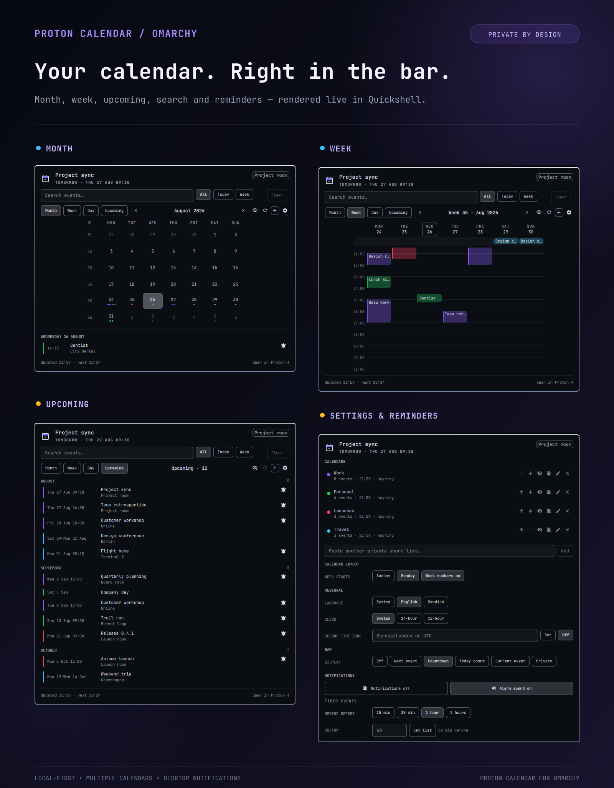

# Proton Calendar for Omarchy

Your Proton Calendar in the Omarchy bar: what's next, a month grid, a week
grid, and an upcoming list — with a quick add that hands off to the Proton web
app.



## What's new in 0.4.1

- Complete Swedish localization across weekdays, months, dates, navigation,
  reminders, calendar management, status text, and settings controls
- Language-aware date formatting that follows the plugin language instead of
  the desktop locale
- Refreshed English preview with isolated demo calendars and no personal data

## What's new in 0.4.0

- Full event details with descriptions, locations, participants, organizers,
  recurrence status, source time zones, and one-click meeting links
- A focused day view plus search and `All`, `Today`, and `Week` filters
- Multiple reminders, all-day reminders, per-calendar alert defaults, and
  notification actions for opening, snoozing, and dismissing
- Share links migrate from `feeds.json` into Secret Service when available
- Per-calendar visibility, order, name, color, sync status, and notification controls
- Six bar modes including countdown, current event, today count, and privacy
- Richer quick add with end time, calendar, location, and private clipboard handoff
- English and Swedish UI, 12/24-hour clocks, secondary time zones, and optional week numbers

## What's new in 0.3.0

- Choose Sunday or Monday as the first day of the week from the settings panel

## What's new in 0.2.0

- Desktop notifications one hour before timed events by default
- Global reminder presets, custom minutes, and per-event overrides
- Optional alarm sound with four live-preview choices
- One-minute notification test directly from the settings panel
- Official Proton Calendar icon in desktop notifications
- A cleaner, aligned notification settings layout

## What it does, and what it can't

Proton Calendar has no CalDAV and no public write API. Reading works well:
the plugin fetches your calendar's share link (plain iCalendar over HTTPS),
expands recurring events, and caches the result. Writing is a handover —
quick add copies the title to your clipboard and opens the Proton web app on
the right day, but you finish the event in the browser.

The share link is a secret URL — anyone holding it can read that calendar,
and its contents are no longer end-to-end encrypted the way the rest of your
Proton data is.

## Requirements

```bash
sudo pacman -S --needed python-icalendar python-recurring-ical-events wl-clipboard libsecret libnotify
```

`python-icalendar` and `python-recurring-ical-events` are required for the
plugin to work at all — without them it can't parse your calendar feed.
`wl-clipboard` is needed for the quick-add clipboard handover.
`libsecret` stores share links in the desktop keyring, while `libnotify`
provides actionable reminders. If Secret Service is unavailable, the plugin
keeps the link in an owner-only `feeds.json` without deleting it.

## Install

```bash
omarchy plugin add https://github.com/itsmoorgrove/omarchy-protoncalendar --enable
```

Then open the panel and paste your calendar's share link (Proton Calendar →
Settings → Calendars → your calendar → Share → Share with anyone).

## Features

- **Bar mark** — pips for how much is on today, a warning colour when a feed
  is stale, and the next event's title beside it
- **Month** — always six rows, ISO week numbers, today outlined, up to four
  event dots per day
- **Week** — an hour grid with an all-day band, overlapping events side by
  side, a line for right now, and a Sunday or Monday week start
- **Day** — one spacious timeline focused on the selected day
- **Upcoming** — everything ahead as one dated list, grouped by month
- **Event details** — description, location, attendees, organizer, recurrence,
  source and secondary time zones, plus meeting and Proton actions
- **Search** — text search across event content with today and week scopes
- **Quick add** — start/end time, all-day, calendar, and location handoff to Proton
- **Multiple calendars** — reorder, rename, recolor, hide, pause, and configure alerts
- **Notifications** — multiple lead times, all-day and per-calendar defaults,
  per-event overrides, sounds, snooze, dismiss, and a built-in test
- **Privacy** — keyring-backed share links and a bar mode that never exposes titles

The plugin sends standard freedesktop notification actions. Omarchy currently
uses a notification-card click for the default `Open in Proton` action; snooze
controls are always available from the event detail card even when the active
notification theme does not render secondary action buttons.

## Keyboard

| Key | Action |
|---|---|
| `←`/`→` or `[`/`]` | Previous / next month or week |
| `↑`/`↓` or `{`/`}` | Previous / next year or four weeks |
| `t` / `enter` | Back to today |
| `m` / `e` / `u` | Month / week / upcoming |
| `d` | Day view |
| `/` | Focus event search |
| `b` | Cycle the bar label |
| `s` | Show/hide calendars |
| `n` / `a` | New event |
| `o` | Open the selected day in Proton |
| `r` | Refresh |
| `w` | Toggle week start |
| `esc` | Close |

Right-click the bar widget to cycle the bar label; middle-click to refresh.

## Settings

| Key | Type | Default | Meaning |
|---|---|---|---|
| `refreshIntervalSec` | integer | 900 | Feed poll interval |
| `barMode` | enum | `Countdown` | `Off`, `Next event`, `Countdown`, `Today count`, `Current event`, or `Privacy` |
| `defaultView` | enum | `Month` | `Month`, `Week`, `Day`, or `Upcoming` |
| `weekStartDay` | enum | `Sunday` | `Sunday` or `Monday` |
| `language` | enum | `System` | `System`, `English`, or `Swedish` |
| `timeFormat` | enum | `System` | `System`, `24-hour`, or `12-hour` |
| `secondaryTimeZone` | timezone | — | Optional IANA zone such as `Europe/London` or `UTC` |
| `showWeekNumbers` | boolean | `true` | Show ISO week numbers in month view |
| `dayStartHour` | integer | 7 | Week view window start |
| `dayEndHour` | integer | 22 | Week view window end |
| `quickAddDurationMinutes` | integer | 60 | Default quick-add event duration |
| `notificationsEnabled` | boolean | `true` | Desktop notifications for timed events |
| `notificationSoundEnabled` | boolean | `true` | Alarm sound with event notifications |
| `notificationSound` | enum | `Alarm` | `Gentle`, `Bell`, `Chime`, or `Alarm` |
| `reminderMinutes` | integer | 60 | Default notification lead time |
| `reminderMinutesList` | integer list | `[60]` | One or more notification lead times |
| `allDayNotificationsEnabled` | boolean | `false` | Desktop notifications for all-day events |
| `allDayReminderDays` | integer | 1 | Days before an all-day event |
| `allDayReminderHour` | integer | 9 | Local hour for all-day notifications |
| `feedsFile` | path | — | Defaults to `~/.config/omarchy/protoncalendar/feeds.json` |

## Tests

`test/run` exercises the backend and `Model.js` against a synthetic
iCalendar fixture — all-day events, multi-day spans, recurrence, and a
daily rule crossing the autumn DST change.

```bash
./test/run
```

## Removal

```bash
omarchy plugin remove io.github.itsmoorgrove.protoncalendar
rm -rf ~/.config/omarchy/protoncalendar ~/.cache/omarchy/protoncalendar
```

## License

MIT. See [LICENSE](LICENSE).
